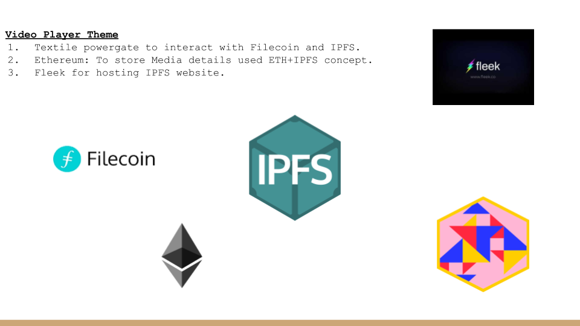

# SkyStorage - (HackFS-2020)

SkyStorage is a decentralized video player. Where user can upload video on web3 platforms like Filecoin and IPFS.   
Platform will give ability to users for change the storage config of individual video file(like change in, hot and cold storage).    
Skystorage will retrieve only uploaded videos by login users. And give accessibilty on this video files as a video player on the platform.  
Even, The platform storing the video file details on ethereum blockchain.  
SkyStorage is hosted on fleek.co hosting service.


### Video Demo


[](<link> "SkyStorage")


### How to run and use for devs?

```note:  You must have Linux system to setup```

- Run localnet on your on machine  
1). `Open New Terminal`  
1). `git clone git@github.com:textileio/powergate.git`  
2). `cd powergate/docker`  
3). `BIGSECTORS=true make localnet`  

- Run Dapp on localhost  
1). clone repo `https://github.com/sunnyRK/SkyStorage.git`  
2). `cd SkyStorage`  
3). Install dependencies for dapp `npm install`   
4).Run Dapp `node server.js`  
5). Go to `http://localhost:8000`    


# Tech Stack We are using

  - Filecoin-IPFS
  - Textile Powergate - To interact with Filecoin and IPFS
  - Ethereum (ETH+IPFS concept to save file details)
  - Fleek.Co to Host Website
  - Next.Js and Material UI For Frontend

### Contacts

`radadiyasunny970@gmail.com`  
[Twitter](https://twitter.com/RadadiyaSunny)

`rajatbeladiya7@gmail.com`  
[Twitter](https://twitter.com/rajat_beladiya)